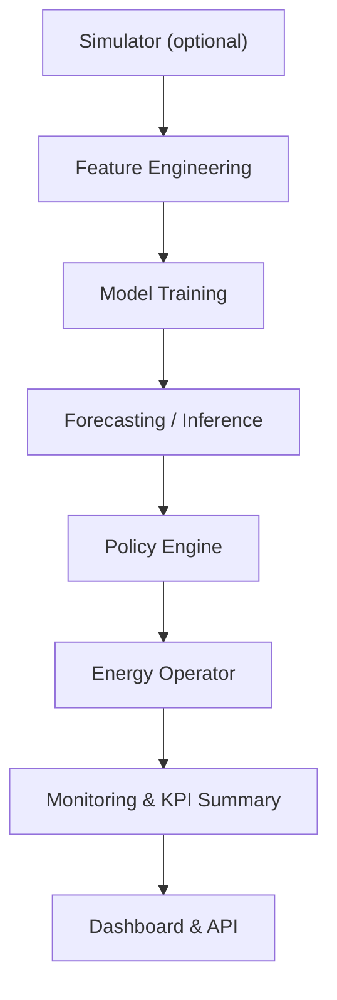

# 5G ENERGY OPTIMIZATION PIPELINE

### AI-Driven Energy Efficiency for 5G Base Stations

**Developer:** Melek Inaç
**Program:** Turkcell – Geleceği Yazan Kadınlar (Advanced Machine Learning Track)
**Location:** İzmir, Türkiye

---

## Overview

This project optimizes **energy consumption in 5G base stations** through **AI-based traffic forecasting** and **dynamic energy management**.
By analyzing real-time RSRP, SNR, CQI, and throughput data, the system predicts traffic demand and intelligently switches base stations between **Active** and **Sleep** modes — saving energy and reducing CO₂ emissions.

---

## System Architecture



All modules are implemented as **Dockerized microservices** and orchestrated automatically using
`start_all.sh`.
With a single command, the complete AI pipeline starts and operates end-to-end — from **data ingestion** to **intelligent power management**.

---

### ⚙️ Main Components

| Component                    | Description                                                                       | Output Table                                    |
| ---------------------------- | --------------------------------------------------------------------------------- | ----------------------------------------------- |
| **feature_job**              | Cleans and engineers raw telemetry into feature sets.                             | `cell_features`                                 |
| **train_job**                | Trains ML models for classification (signal quality) and regression (throughput). | `model_metrics`, `cell_policy`, `cell_forecast` |
| **forecast_job**             | Predicts network load (`y_hat`, confidence intervals).                            | `cell_forecast`                                 |
| **inference_job**            | Runs real-time inference using latest trained models.                             | `cell_forecast`                                 |
| **policy_job**               | Applies YAML-based policy rules (increase / decrease / hold).                     | `cell_policy`, `cell_status`                    |
| **energy_operator**          | Executes simulated power mode actions (Active / Sleep).                           | `cell_operation_log`                            |
| **monitoring_job**           | Detects data drift and triggers retraining.                                       | Logs & retrain events                           |
| **kpis_job**                 | Aggregates daily energy and performance KPIs.                                     | `cell_kpis_daily`                               |
| **api**                      | FastAPI backend serving REST endpoints.                                           | Backend                                         |
| **dashboard**                | React frontend visualizing KPIs and forecasts.                                    | Frontend                                        |
| **simulator_job (optional)** | Generates synthetic 5G cell data for testing.                                     | `cell_clean_data`                               |

---

## Workflow

### 1️⃣ Feature Engineering

-   Cleans raw telemetry (**RSRP, SNR, ping, Mbps**).
-   Creates rolling averages, lags, and time-context features.
-   Results stored in **`cell_features`**.

### 2️⃣ Model Training

-   **Classification:** Predicts `signal_class` (Excellent / Good / Weak).
-   **Regression:** Forecasts `dl_mbps_mean_fwd_1h` for next-hour throughput.
-   Saves best models into `/models` and logs metrics to `model_metrics`.

### 3️⃣ Forecasting / Inference

-   Generates hourly throughput predictions with confidence intervals.
-   Derives traffic trends (**increase**, **decrease**, **stable**).
-   Writes results into **`cell_forecast`**.

### 4️⃣ Policy Engine

Combines signal class and traffic trend to decide energy actions:

-   Weak + Downtrend → **Decrease (Sleep)**
-   Good + Uptrend → **Increase (Activate)**
-   Otherwise → **Hold / Monitor**

Outputs decisions to `cell_policy` and updates live status in `cell_status`.

### 5️⃣ Energy Operator

Executes simulated power operations:

-   **"SLEEP"** → reduces energy use.
-   **"ACTIVE"** → restores power.
    Logs every action in **`cell_operation_log`**.

### 6️⃣ Monitoring

-   Continuously monitors data drift.
-   If deviation > threshold → **automatically retrains** models (`train_job`).

### 7️⃣ KPI Aggregation

-   Calculates total and saved kWh, CO₂ reduction, and daily KPI summaries.
-   Writes results into **`cell_kpis_daily`**.

### 8️⃣ Visualization

-   **Dashboard:** Interactive React UI for forecasts, trends, and KPIs.
-   **API:** FastAPI endpoints serve live data to the dashboard.

---

## Tech Stack

-   **Python 3.11**, FastAPI, SQLAlchemy, Pandas, Scikit-Learn, XGBoost, LightGBM
-   **PostgreSQL 16**, pgAdmin 8
-   **React**, TailwindCSS, Recharts
-   **Docker Compose** for orchestration
-   **Optuna** for hyperparameter tuning

---

## Quick Start

### 1️⃣ Clone the Repository

```bash
git clone https://github.com/melekinac/5g-feature-pipeline.git
cd 5g-feature-pipeline
```

### 2️⃣ Configure Environment

Edit your `.env` file:

```bash
POSTGRES_USER=postgres5g
POSTGRES_PASSWORD=postgres5g
POSTGRES_DB=user_activity_db
PGADMIN_DEFAULT_EMAIL=adminmelek@example.com
PGADMIN_DEFAULT_PASSWORD=adminmelek123*
SIM_INTERVAL_SEC=5
SIM_NUM_CELLS=5
SIM_DURATION_MIN=60
KPI_START_DATE=2019-12-01
KPI_END_DATE=2020-03-01
```

### 3️⃣ Start All Services

```bash
bash start_all.sh
```

The script will:

-   Start PostgreSQL & pgAdmin
-   Wait for initialization
-   Launch all AI jobs (`feature_job`, `train_job`, `forecast_job`, etc.)
-   Start API (port 8000) and Dashboard (port 3000)

**Access:**

-   API → [http://localhost:8000](http://localhost:8000)
-   Dashboard → [http://localhost:3000](http://localhost:3000)
-   pgAdmin → [http://localhost:5050](http://localhost:5050)

---

## Optional Simulation Mode

If real 5G data is unavailable, enable the simulator:

```bash
docker compose up simulator_job
```

This generates synthetic cell data (`cell_clean_data`) for the entire pipeline.

---

## Example Outputs

| Metric          | Example Value | Description                       |
| --------------- | ------------- | --------------------------------- |
| `saved_kwh`     | 12.45 kWh     | Energy saved compared to baseline |
| `saved_pct`     | 8.6 %         | Energy saving rate                |
| `co2_ton_saved` | 0.0052 ton    | Equivalent CO₂ reduction          |
| `saved_tl`      | 78.3 ₺        | Energy cost saved                 |

---

## Results & Benefits

✅ Up to **10–15 %** energy saving in low-traffic hours
✅ Reduced **CO₂ footprint** (aligned with AI4EE sustainability goals)
✅ **Dynamic AI-driven** optimization without manual intervention
✅ Modular, **fully automated** orchestration using Docker Compose
✅ Real-time visibility via **interactive dashboard**

---

## 🧾 License

2025 Melek Inaç – All rights reserved.

---
